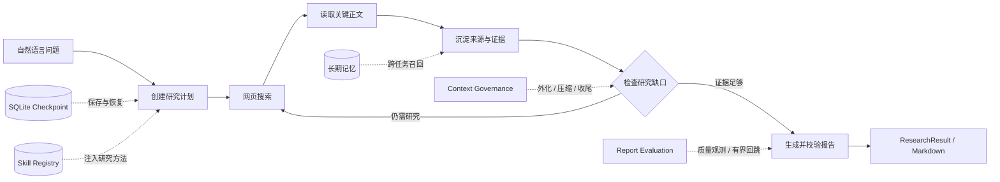
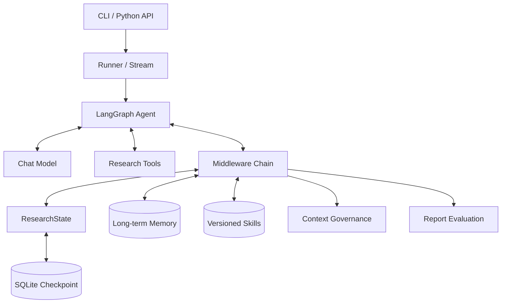

<div align="center">


# 🔬 DeepResearch Agent

**一个可运行、可恢复、可审计的深度研究智能体，也是一份面向 AI Agent 爱好者的工程学习参考。**

从自然语言问题出发，自动规划研究、搜索并读取网页、整理证据，最终生成带来源的 Markdown 报告。

[](https://github.com/1612535983/deepreseach-learing/actions/workflows/tests.yml)


[](LICENSE)

[快速开始](#快速开始) · [工作流程](#工作流程) · [核心架构](#核心架构) · [学习路线](#面向爱好者的学习路线) · [进阶能力](#进阶能力) · [示例报告](examples/sample-report.md)

</div>

---

## 项目定位

DeepResearch Agent 是一个基于 LangGraph 构建的深度研究 Agent。

它希望同时回答两个问题：

1. **一个深度研究 Agent 怎样可靠地完成长任务？**
2. **学习者怎样从最小 Agent 出发，逐步理解并复现一套完整的工程系统？**

因此，这个项目既可以作为可运行的研究工具，也可以作为 AI Agent 爱好者的学习参考。你可以直接用它生成研究报告，也可以沿着 CLI、State、Tool、Middleware、Checkpoint、Memory 和 Skill 的顺序阅读代码，理解一次研究任务如何在系统中流动。

| 角色 | 可以从项目中获得什么 |
|---|---|
| **使用者** | 输入一个开放问题，获得带来源的研究回答、执行记录和可选 Markdown 报告 |
| **学习者** | 观察一个 Agent 如何规划、调用工具、管理状态、处理中断、控制上下文并完成收尾 |
| **开发者** | 在模块化结构上替换模型、扩展工具、增加 Middleware，或接入自己的存储与评估服务 |

> [!NOTE]
> 这是一个面向学习与工程实践的项目。代码和测试覆盖了 README 中描述的主要能力，但“有引用”不等于“事实一定正确”，概率评估也不能代替人工核验。

## 输入与输出

| | 内容 |
|---|---|
| **输入** | 一个非空自然语言问题，例如“LangChain Agent 如何工作？” |
| **输出** | 最终回答、完整 `ResearchState`、任务 `thread_id`，以及可选 Markdown 报告 |
| **适合** | 技术调研、概念梳理、方案比较、需要网页证据和引用的开放问题 |
| **暂不保证** | 来源内容一定真实、语义结论一定正确，或任何一次运行都能获得相同结果 |

## 核心特点

- **研究闭环**：计划、搜索、正文读取、证据聚合、缺口检查、引用校验和报告生成。
- **可恢复**：使用 SQLite Checkpoint 保存任务，进程中断后可以通过 `thread_id` 继续执行。
- **可审计**：程序记录真实 Tool 调用、来源、证据和模型可见上下文，不依赖模型描述自己做过什么。
- **有边界**：通过 Token 治理、搜索与阅读预算、有限 Reflection 和强制收尾避免无限循环。
- **可扩展**：模型、Tool、Middleware、Memory、Skill 和评估层相互分离。
- **适合学习**：模块职责明确，提供离线 Demo、自动化测试、名词解释和分阶段阅读路线。

## 快速开始

项目要求 Python 3.12+，推荐使用 [`uv`](https://docs.astral.sh/uv/) 管理环境。

```bash
git clone https://github.com/1612535983/deepreseach-learing.git
cd deepreseach-learing
uv sync --extra dev
```

先运行完全离线的 Demo，不需要 API Key：

```bash
uv run deepresearch demo
```

预期输出：

```text
最小链路已跑通：命令行输入已经进入 LangChain Agent Graph，模型响应也已被封装为 ResearchResult。
```

运行测试：

```bash
uv run pytest -q
```

当前项目包含 **302 个自动化测试**，覆盖 Agent、Tool、Middleware、Checkpoint、上下文治理、Memory、Skill 和报告评估。

### 接入真实模型

复制环境变量模板：

```bash
cp .env.example .env
```

项目通过 `ChatOpenAI` 接入兼容 OpenAI Chat Completions 协议的模型服务。`.env.example` 默认以 DeepSeek 为例：

```dotenv
DEEPRESEARCH_API_KEY=sk-your-api-key
DEEPRESEARCH_MODEL=deepseek-chat
DEEPRESEARCH_BASE_URL=https://api.deepseek.com
```

运行一次真实研究：

```bash
uv run deepresearch run "请解释 ReAct Agent 的基本工作方式"
```

实时查看计划、工具调用、证据和报告进度，并把结果保存为 Markdown：

```bash
uv run deepresearch run "研究 LangChain Agent" \
  --stream \
  --show-trace \
  --output reports/langchain-agent.md
```

可以先查看[示例报告：LangChain Agent 如何工作？](examples/sample-report.md)。示例经过压缩，用于展示输出结构；真实内容会随研究问题、模型和搜索结果变化。

## 工作流程



整个流程可以理解为：

1. CLI 接收问题和运行参数。
2. Agent 创建结构化研究计划。
3. 模型选择搜索、正文读取、计划更新或报告工具。
4. Middleware 把真实工具结果整理为来源和证据，并同步到 State。
5. 程序检查计划、证据、上下文和工具预算，决定继续研究还是开始收尾。
6. 报告工具校验引用，把 Markdown 写入 `State.final_report`。
7. Runner 返回 `ResearchResult`，也可以把报告保存到本地文件。

## 核心架构

本项目刻意把模型能力与确定性程序逻辑分开：

- **模型负责**：理解问题、制定计划、选择工具、判断下一步和撰写报告。
- **程序负责**：记录真实执行结果、更新状态、校验引用、保存 Checkpoint、控制预算和处理失败。

这样既保留了 Agent 的灵活性，也让关键行为可以测试、恢复和审计。



### 组件的输入、输出与职责

| 组件 | 输入 | 输出 | 解决的问题 |
|---|---|---|---|
| CLI / Runner | 问题、参数、`thread_id` | `ResearchResult`、流式事件、报告文件 | 统一启动、恢复和展示任务 |
| Agent Graph | Messages、State、模型响应 | 下一次模型调用或 Tool 调用 | 组织模型与工具的循环 |
| Research Tool | 查询词、URL、计划步骤、报告 | 搜索记录、正文、计划更新、最终报告 | 让模型能够对外执行动作 |
| Middleware | 模型请求、Tool 结果、State | 状态更新、约束、路由决策 | 集中处理证据、反思、预算和上下文 |
| ResearchState | 每一步产生的结构化更新 | 当前任务的完整状态 | 避免只依赖对话历史记录事实 |
| Checkpointer | Graph State、`thread_id` | SQLite 快照 | 让长任务可以跨进程恢复 |
| Memory | 已完成任务和当前问题 | 可跨任务召回的记忆 | 复用过去任务中的有效信息 |
| Skill | `SKILL.md`、问题、可用 Tool | 受预算限制的过程知识 | 复用“应该怎样研究”的方法 |
| Evaluation | 问题、报告、来源和证据 | 概率、质量分和建议动作 | 观测报告质量并有限控制回跳 |

## 项目结构

```text
.
├── src/deepresearch/
│   ├── cli.py               # 命令行入口
│   ├── agent.py             # 组装并运行 Agent Graph
│   ├── state.py             # 研究状态与 reducer
│   ├── checkpointing.py     # SQLite Checkpoint 与任务恢复
│   ├── events.py            # 流式事件
│   ├── tools/               # 搜索、正文读取、计划和报告工具
│   ├── middlewares/         # 证据、反思、治理、记忆等横切逻辑
│   ├── context/             # Token、外化、快照、摘要和收尾策略
│   ├── memory/              # 长期记忆存储、检索与 Worker
│   ├── skill/               # Skill 解析、版本、选择、注入和指标
│   └── evaluation/          # 报告概率评估与 Provider 适配
├── tests/                   # 自动化测试
├── examples/                # 输出样例
├── docs/assets/             # README 素材
├── .github/workflows/       # GitHub Actions
└── pyproject.toml           # 依赖、脚本入口与打包配置
```

## 面向爱好者的学习路线

如果你刚开始学习 Agent，不建议直接从最复杂的 Middleware 入手。可以按照下面的顺序阅读和动手：

| 阶段 | 建议阅读 | 重点问题 | 可以尝试的练习 |
|---|---|---|---|
| 1. 跑通最小链路 | `cli.py → agent.py` | 用户问题怎样进入模型，又怎样变成结果？ | 修改离线 Demo 的输入和输出 |
| 2. 理解状态 | `state.py` | 为什么 Agent 需要 State，而不只需要聊天记录？ | 增加一个研究统计字段 |
| 3. 理解工具 | `tools/` | 模型怎样发起搜索？Tool 结果怎样返回模型？ | 新增一个简单 Tool |
| 4. 理解横切逻辑 | `middlewares/evidence.py`、`reflection.py` | 如何在不污染 Tool 的情况下收集证据和检查缺口？ | 为一条规则增加测试 |
| 5. 理解长任务 | `checkpointing.py`、`events.py` | 如何保存进度、恢复任务并实时显示过程？ | 中断任务后使用 `resume` |
| 6. 理解上下文工程 | `context/`、相关 Middleware | 上下文过长时，怎样外化、压缩并安全收尾？ | 调低阈值观察治理事件 |
| 7. 理解能力复用 | `memory/`、`skill/` | “记住什么”和“应该怎样做”有什么区别？ | 编写一个自己的 `SKILL.md` |
| 8. 理解质量评估 | `evaluation/` | 概率评估怎样进入系统，又怎样避免失控回跳？ | 使用 Shadow 模式收集结果 |

推荐的完整代码阅读顺序：

```text
cli.py
  ↓
agent.py
  ↓
state.py
  ↓
tools/
  ↓
middlewares/
  ↓
context/
  ↓
memory/ → skill/ → evaluation/
```

这个顺序先回答“输入如何变成输出”，再逐步展开状态、工具、可靠性和高级能力，适合边运行、边阅读、边修改。

## 值得关注的工程问题

| 工程问题 | 本项目的处理方式 | 主要取舍 |
|---|---|---|
| 模型可能描述并未发生的操作 | 程序记录真实 Tool 调用、来源和 Observation | State 更复杂，但执行事实可以审计 |
| 长任务中断后需要重新开始 | SQLite Checkpoint + `thread_id` 恢复 | 需要管理任务 ID 和持久化文件 |
| 搜索结果不断挤占上下文 | P1 外化、P4 Snapshot 与摘要、P5 强制收尾 | 压缩可能损失细节，因此先保存可校验快照 |
| 搜索失败或重复调用形成死循环 | 总次数、连续失败、重复查询和收尾预算 | 达到边界后可能基于不完整证据生成报告 |
| 模型生成不存在的引用 | 报告 Tool 校验 URL 是否来自已收集来源 | 能校验引用存在，不能自动保证来源内容为真 |
| 质量判断影响正常任务 | 默认 Shadow、有限 Gate、签名幂等和 fail-open | 概率只作为决策信号，不作为事实正确率 |
| 恢复状态和长期知识容易混淆 | Checkpoint 与 Memory 使用两条独立持久化路径 | 组件更多，但职责和生命周期更清楚 |

这些问题也是阅读项目时最值得追问的部分：不仅要知道“使用了什么技术”，还要理解它解决了什么问题，以及付出了什么代价。

## 常用命令

### 流式运行与执行记录

```bash
uv run deepresearch run "研究 LangChain Agent" --stream --show-trace
```

`--stream` 展示由真实 Graph 更新转换出的 `ResearchEvent`；`--show-trace` 读取 State 中的搜索、正文、来源、证据、上下文和评估统计，不会额外调用模型。

### 保存 Markdown 报告

```bash
uv run deepresearch run "研究 LangChain Agent" \
  --output reports/langchain-agent.md
```

程序不会覆盖已经存在的文件。报告正文来自 `State.final_report`；如果已完成质量评估，还会追加程序确定性渲染的评估附录。

### 中断恢复与状态查看

```bash
uv run deepresearch run "研究 LangGraph" \
  --thread-id research-001 \
  --stream

uv run deepresearch resume research-001 --stream
uv run deepresearch inspect research-001
```

- 新任务应该使用新的 `thread_id`。
- `resume` 从最近的 Graph 快照继续，不会重新创建初始 State。
- `inspect` 只读取最新持久化摘要，不会调用模型。
- 不要让两个进程同时执行同一个 `thread_id`。

## 进阶能力

以下能力默认关闭，便于学习者先理解最小研究链路，再按需启用。

<details>
<summary><strong>长期记忆：跨任务复用信息</strong></summary>

Checkpoint 保存“同一个任务怎样继续”，Memory 保存“后续任务可能再次用到什么”。两者不是同一个概念。

```dotenv
DEEPRESEARCH_MEMORY_USE=default
DEEPRESEARCH_MEMORY_NAMESPACE=default
DEEPRESEARCH_MEMORY_ENABLE_RECALL=true
DEEPRESEARCH_MEMORY_ENABLE_EXTRACT=false
```

Retriever 使用基础中英文分词、BM25 和记忆强度排序。召回内容只进入当前模型请求的 `<memory_context>`，不会写入正式对话历史。

</details>

<details>
<summary><strong>Skill：复用研究方法</strong></summary>

Tool 解决“Agent 能执行什么动作”，Skill 解决“Agent 应该怎样完成某类任务”。

```dotenv
DEEPRESEARCH_SKILL_USE=default
DEEPRESEARCH_SKILL_DIRS=skills
DEEPRESEARCH_SKILL_INCLUDE_BUILTIN=true
```

```bash
uv run deepresearch skills validate
uv run deepresearch skills list
uv run deepresearch skills show source-verification
uv run deepresearch run "核验这项声明并给出来源" --skill source-verification
```

项目自带 `web-research`、`source-verification` 和 `evidence-report-writing` 三个 Skill。Skill 使用不可变版本和内容哈希，保证旧任务恢复时仍能读取当时使用的版本。

</details>

<details>
<summary><strong>Jev：报告质量概率评估</strong></summary>

评估层接收经过限长的研究问题、最终报告、引用来源、相关证据和计划摘要，输出回答相关性、证据支持、引用充分性、证据充分性、继续研究概率和来源质量分。

建议先使用 Shadow 模式，只记录结果而不改变 Agent 路由：

```dotenv
DEEPRESEARCH_EVALUATION_USE=jev
DEEPRESEARCH_EVALUATION_MODE=shadow
DEEPRESEARCH_JEV_API_KEY=your-typesafe-api-key
```

在带人工标签的数据上确认阈值后，才建议启用有界 Gate。Provider 超时、返回无效响应或网络失败时采用 fail-open，不阻断研究结果返回。

> 概率是评估模型的判断，不是事实正确率。

</details>

<details>
<summary><strong>上下文治理：外化、压缩与强制收尾</strong></summary>

- **P1 外化**：把较旧的大型 Tool 结果保存到文件，只在消息中保留预览、路径和校验信息。
- **P4 压缩**：先保存带 SHA-256 校验的 Snapshot，再用结构化摘要替换较旧历史。
- **P5 收尾**：上下文接近上限后禁止继续搜索和读取，只允许有限地更新计划、提交报告或直接结束。

任何外化、快照或压缩步骤失败时，系统都会优先保留原始消息，避免为了节省 Token 丢失证据。

</details>

## 名词解释

- **Agent**：让模型能够根据当前状态选择下一步动作的执行系统。
- **Tool**：模型可以调用的程序能力，例如搜索、读取网页和提交报告。
- **State**：Graph 节点共享的结构化任务状态，例如计划、来源、证据和最终报告。
- **Middleware**：插入模型或 Tool 生命周期的横切逻辑，例如收集证据、检查缺口和控制预算。
- **Checkpoint**：某一执行时刻的 State 和 Graph 位置，用于恢复同一个任务。
- **Memory**：跨任务保存和召回的信息，不负责恢复 Graph 的执行位置。
- **Skill**：告诉 Agent“应该怎样完成某类任务”的过程知识，不等同于可执行 Tool。
- **Reflection**：Agent 准备结束时进行的缺口检查；本项目对回跳次数设置了上限。
- **Token / 上下文窗口**：模型处理文本的计量单位，以及一次请求能够容纳的 Token 上限。
- **Shadow / Gate**：Shadow 只观测评估结果；Gate 可以根据阈值有限地改变后续路由。

## 当前边界与后续方向

当前项目是一个 **单 Agent、CLI 优先的深度研究内核**，重点是把状态、证据、恢复、上下文和评估链路做清楚。

目前尚未实现：

- 完整 Web 应用和对外 API；
- MCP 与独立 Sandbox；
- 多 Agent 并行研究；
- 使用人工标注数据完成概率校准；
- 对事实正确率、报告质量和成本进行系统 Benchmark。

后续计划优先补充评估数据集，计算 Brier Score、ECE 和质量/成本指标，再考虑 MCP、Sandbox、API、前端与多 Agent。

## 测试与贡献

```bash
uv run pytest -q
```

每次 push 或 pull request 都会通过 GitHub Actions 在 Python 3.12 上运行测试。

欢迎通过 Issue 提交 Bug、文档建议或可复现的改进想法。提交代码前请保证：

1. 不包含 API Key、`.env`、本地数据库、报告或运行时记忆；
2. 一个提交只处理一个可以解释的问题；
3. 新行为包含对应测试，现有测试保持通过；
4. README、类型注解和错误信息与代码行为一致。

## 致谢与架构参考

项目建立在 [LangChain](https://github.com/langchain-ai/langchain) 与 [LangGraph](https://github.com/langchain-ai/langgraph) 的公开能力之上；设计过程中也参考了 [DeerFlow](https://github.com/bytedance/deer-flow)、[Open Deep Research](https://github.com/langchain-ai/open_deep_research)、[Poirot](https://github.com/HezaoHezao/poirot) 等开源项目的架构思路。

本项目没有逐模块移植上述项目，也不与它们存在官方关系。具体参考内容和设计取舍见 [ACKNOWLEDGMENTS.md](ACKNOWLEDGMENTS.md)。

本项目采用 [MIT License](LICENSE)。你可以学习、使用和修改代码；分发副本或重要代码片段时，请保留许可证和版权声明。
