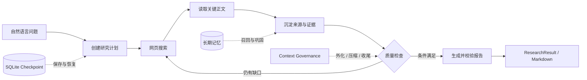

<div align="center">


# 🔬 DeepResearch Agent

**一个可运行、可恢复、可审计的深度研究智能体**

从自然语言问题出发，自动规划研究、搜索与读取网页、沉淀证据，并生成带来源的 Markdown 报告。

[](https://github.com/1612535983/deepreseach-learing/actions/workflows/tests.yml)


[](LICENSE)

[快速开始](#快速开始) · [工作流程](#工作流程) · [核心设计](#核心设计) · [学习路线](#分阶段复现路线) · [示例报告](examples/sample-report.md)

</div>

---

## 项目简介

DeepResearch Agent 是一个面向学习与工程实践的 LangGraph 研究 Agent。它的输入是一个
自然语言问题，输出是包含回答、完整运行状态和可选 Markdown 报告的 `ResearchResult`。

它解决的不是“调用一次大模型”，而是如何让模型在一个有边界的执行系统中完成长任务：

- 先创建计划，再逐步搜索、阅读和整理证据；
- 用结构化 State 记录事实，而不是依赖模型描述自己做过什么；
- 用 Checkpoint 保存任务，使进程中断后仍能继续；
- 在上下文接近上限时外化、压缩并强制收尾；
- 在不同任务之间按需召回长期记忆。

> [!NOTE]
> 本项目是受 [Poirot](https://github.com/HezaoHezao/poirot) 启发的独立学习型实现，
> 不是 Poirot 官方项目，也不是对其源码的逐文件复制。项目按照可运行、可测试的 Git 阶段，
> 从最小 Agent 逐步重建 Tool、Middleware、State、Checkpoint、Context Governance 和 Memory。

### 输入与输出

| | 内容 |
|---|---|
| **输入** | 一个非空自然语言问题，例如“LangChain Agent 如何工作？” |
| **输出** | 最终回答、完整 `ResearchState`、任务 `thread_id`，以及可选 Markdown 报告 |
| **适合** | 技术调研、概念梳理、需要网页证据和引用的开放问题 |
| **暂不保证** | 来源内容一定真实、语义结论一定正确；当前依靠规则检查完整性，不代替事实核验 |

## 核心能力

| 🔎 研究闭环 | 🧭 可恢复执行 | 📐 上下文治理 |
|---|---|---|
| 计划、搜索、正文读取、证据聚合、引用校验、报告生成 | SQLite Checkpoint、`thread_id` 隔离、流式事件、任务恢复 | Token 观测、P1 外化、P4 摘要压缩、P5 强制收尾 |
| **🧠 长期记忆** | **🛡️ 安全边界** | **✅ 工程质量** |
| Markdown truth store、BM25 召回、衰减、软遗忘、后台巩固 | SSRF 防护、重定向复检、响应体限制、密钥隔离 | 184 个测试、离线 Demo、GitHub Actions、模块化 Middleware |

## 工作流程



当前版本已完成 **阶段 10：长期记忆**。上下文占用达到 40% 后执行 P1 外化；达到 80%
后先保存可验证 Snapshot，再用结构化摘要替换较旧历史；达到 90% 后进入 P5 收尾模式，
禁止继续扩张研究。P2、P3 当前用于治理观测，尚未单独改写上下文。

<details>
<summary><strong>展开完整 Agent 执行链</strong></summary>


```text
命令行问题
    ↓
Settings 读取模型配置
    ↓
ChatOpenAI（兼容 OpenAI 协议的模型）
    ↓
create_agent() 编译 Agent Graph
    ├── messages
    ├── research_question
    ├── search_records
    ├── page_records
    ├── plan / current_step_id
    ├── reflection_attempts / research_gaps
    ├── sources / observations
    ├── final_report
    ├── governance.context
    │   ├── 当前 Token / 上下文窗口 / 占用比例
    │   ├── 累计 Token / 模型调用次数
    │   └── pending_stages / hard_limit_reached
    ├── tagged_context（最后一次模型可见上下文的审计快照）
    └── SQLite Checkpointer（按 thread_id 持久化快照）
    ↓
ContextGovernanceMiddleware 调用模型前测量完整请求并判断 P1～P5
    ↓ P1 pending
ContextExternalizationMiddleware 外化较旧的大型 Tool 结果
    ├── 完整内容 → .deepresearch/externalized/<thread_id>/*.json
    ├── ToolMessage → 预览 + 路径 + estimated_tokens_saved
    └── 最近两个大型 Tool 结果保留原文
    ↓
ContextCompactionMiddleware 执行 P4
    ├── 压缩前 State/messages → .deepresearch/snapshots/<thread_id>/*.json
    ├── 内部摘要模型生成结构化 Markdown
    ├── 摘要没有减少 Token → 保留原消息
    └── 摘要成功 → summary + 最近消息（保持 Tool 配对）
    ↓
TaggedContextMiddleware 组装 request-scoped 模型视图
    ├── <system> / <goal> / <date>
    ├── <research_plan> / <research_progress> / <research_gaps>
    └── <turn> / <answer> / <toolcall> / <toolresult>
    ↓
SequentialToolCallMiddleware 禁止并行 Tool Call
    ↓
模型首次调用 write_research_plan
    ↓
模型判断是否调用 web_search
    ├── 不调用 → 直接回答
    └── 调用 → DuckDuckGo 搜索 → ToolMessage
                                ↓
                         EvidenceMiddleware
                         ├── search_records
                         ├── sources（按 URL 去重）
                         └── observations（关联 step_id）
                                ↓
                         再次调用模型
                                ↓
                         选择关键 URL 调用 read_page
                                ↓
                         EvidenceMiddleware
                         ├── page_records
                         └── 正文 observations（关联 step_id）
                                ↓
                         update_plan_step 推进计划
    ↓
ContextFinalizationMiddleware 执行 P5
    ├── 模型请求扩张型 Tool → 剥离 Tool Call，不进入 ToolNode
    ├── 注入隐藏收尾提醒 → jump_to="model"
    ├── 只允许 update_plan_step / write_final_report
    └── 再次违反 → 有界强制停止，避免无限循环
    ↓
模型调用 write_final_report
    ↓
校验研究进度和引用 URL
    ↓
Markdown 报告写入 State.final_report
    ↓
模型准备结束
    ↓
ReflectionMiddleware 程序化检查
    ├── 计划、证据、报告齐全 → 允许结束
    └── 存在缺口 → 写入 research_gaps → 回到模型（最多 2 次）
                                                    ↓
                                      超过上限后保留缺口并允许结束
    ↓
ResearchResult(question, answer, state)
    ↓ 可选 --output
save_markdown_report() 创建 .md 文件
```

</details>

流式模式不会重新组装另一套 Agent。`create_agent()` 仍然只负责生成同一个 Graph，
执行层可以选择 `invoke()` 一次性返回，或者选择 `stream()/astream()` 逐步接收结果：

```text
Compiled Agent Graph
    ├── invoke()  → 最后一次性返回 State
    └── stream()  → updates 转 ResearchEvent，values 保存最终 State
                                      ↓
                                CLI 实时显示
```

Checkpointer 在 `create_agent()` 时装入 Graph；运行时通过 config 提供 `thread_id`：

```text
SqliteSaver → create_agent(checkpointer=...)
                         ↓
graph.stream(..., config={"configurable": {"thread_id": "research-001"}})
                         ↓
LangGraph 在每个执行步骤后自动把 State 保存到 SQLite
                         ↓
下一个 CLI 进程用同一 thread_id 调用 graph.stream(None, config=...)
                         ↓
从最近的 Graph 节点继续执行
```

## 核心设计

这个项目把模型能力和确定性程序逻辑分开：模型负责规划、选择工具和撰写报告；程序负责
记录真实执行结果、约束工具顺序、校验引用、保存 Checkpoint 和控制上下文预算。这样既保留
Agent 的灵活性，也让关键状态可以测试、恢复和审计。

## 快速开始

项目要求 Python 3.12+，推荐使用 `uv`：

```bash
uv sync --extra dev
```

先运行完全离线的 Demo，不需要 API Key：

```bash
uv run deepresearch demo
```

预期看到：

```text
最小链路已跑通：命令行输入已经进入 LangChain Agent Graph，模型响应也已被封装为 ResearchResult。
```

运行测试：

```bash
uv run pytest -q
```

## 接入真实模型

复制环境变量模板：

```bash
cp .env.example .env
```

填写 `.env` 后运行：

```bash
uv run deepresearch run "请解释 ReAct Agent 的基本工作方式"
```

显示由程序根据 State 计算的真实搜索记录和来源：

```bash
uv run deepresearch run "研究 LangChain Agent" --show-trace
```

把最终报告保存为新的 Markdown 文件：

```bash
uv run deepresearch run "研究 LangChain Agent" \
  --output reports/langchain-agent.md
```

`--output` 只负责把 `State.final_report` 写入磁盘，不会调用 LLM，也不会覆盖已有文件。
LLM 负责生成 Markdown 内容；`write_final_report` Tool 负责校验引用并更新 State；
`save_markdown_report()` 才是真正创建 `.md` 文件的代码。

想先看输出长什么样，可以打开
[示例报告：LangChain Agent 如何工作？](examples/sample-report.md)。示例经过压缩，仅用于展示
报告结构；真实输出会随问题、模型和搜索结果变化。

实时显示计划、Tool、证据、反思和报告进度：

```bash
uv run deepresearch run "研究 LangChain Agent" \
  --stream \
  --show-trace \
  --output reports/langchain-agent.md
```

`--stream` 使用程序根据真实 Graph 更新生成的 `ResearchEvent`，不是让 LLM 描述自己做了什么。
流式执行结束后仍会返回完整 `ResearchResult`，因此 Trace 和 Markdown 导出可以继续使用。

为当前运行指定 Checkpoint 任务 ID：

```bash
uv run deepresearch run "研究 LangChain Agent" \
  --thread-id research-001 \
  --stream
```

省略 `--thread-id` 时会自动生成 ID。Checkpoint 默认写入
`.deepresearch/checkpoints.sqlite`，该目录已被 Git 忽略。新任务不能复用已有 ID，以免把新问题
合并进旧 State；如果任务中断，应改用：

```bash
uv run deepresearch resume research-001 --stream
```

`resume` 不会重新调用 `create_initial_state()`。它把 `None` 作为 Graph 输入，并用相同的
`thread_id` 读取最近快照；已完成任务会直接返回保存结果，中断任务会从待执行节点继续。
恢复后的报告也可以配合 `--show-trace` 和 `--output reports/result.md` 使用。

不调用模型、只查看任务的最新持久化摘要：

```bash
uv run deepresearch inspect research-001
```

`inspect` 会显示原问题、Checkpoint 时间、Graph 步骤、计划进度、研究统计，以及保存在
Checkpoint State 中的模型名称、上下文窗口、当前 Token、占用比例、累计 Token、模型调用
次数、`pending_stages`、P1 外化数量和预计节省 Token。同步 Graph 使用 `SqliteSaver`，异步 Graph 使用
`AsyncSqliteSaver`。不要让两个进程同时用同一个 `thread_id` 执行；不同任务应使用不同 ID。

`--show-trace` 中的统计不调用 LLM；它直接读取 `search_records`、`page_records`、
`sources`、`observations` 和 `governance.context`，用于区分真实执行记录与模型生成的
自然语言说明。

`run` 模式会把 `web_search` 和 `read_page` 注册给真实模型；模型可以先搜索，
再选择重要来源读取正文。`write_research_plan` 和 `update_plan_step` 负责创建并推进计划。
研究完成后，模型必须调用 `write_final_report`，并提交 Markdown 内容和实际引用的 URL。
Tool 会确认研究已经完成、至少引用两个收集过的来源，而且声明的 URL 确实出现在报告正文中。
`TaggedContextMiddleware` 每轮从 State 投影系统规则、研究目标、计划进度和聚合计数，并为
对话、回答、Tool Call 和 Tool 结果建立语义标签。投影只修改当次 `ModelRequest`，不会覆盖
State 中的原始消息；最后一次投影另存到 `tagged_context`，用于 Checkpoint 和审计。
`SequentialToolCallMiddleware` 会向模型绑定层传入 `parallel_tool_calls=False`，确保会更新
Plan 和 `current_step_id` 的 Tool 逐轮执行，避免多个 `Command` 同时写入同一个 State 字段。
`ReflectionMiddleware` 在模型不再调用 Tool、准备结束时读取 State，检查计划是否完成、
来源和 Observation 是否达到最小数量、是否成功读取过网页正文。检查不调用额外 LLM；
如果不满足，会把缺口交给下一轮模型，但最多回跳 2 次，避免无限循环。
`ContextGovernanceMiddleware` 在每次模型调用后统计当前消息 Token、识别模型上下文窗口、
累计供应商返回的 Token usage，并按 P1～P5 阈值写入 `governance.context`。它也会在模型
调用前重新测量最终标签化请求，使刚进入 State 的 Tool 结果能在发送给下一轮模型前触发治理。
`ContextExternalizationMiddleware` 消费 `pending_stages` 中的 P1。它只处理达到最小长度的
旧 `ToolMessage`，最近两个结果暂时豁免；完整内容写入成功后，使用相同 message ID 把 State
中的消息替换成预览和路径。外化文件默认位于 `.deepresearch/externalized/<thread_id>/`，
目录已被 Git 忽略。写盘失败时不会替换原消息，以免丢失证据。
`ContextCompactionMiddleware` 消费 P4。它先把压缩前 messages 和非消息 State 保存到
`.deepresearch/snapshots/<thread_id>/`，快照带 schema 版本和 SHA-256 校验，并可恢复为
LangChain 消息。随后由内部摘要调用压缩较旧前缀，最近约 6 条消息按完整交互单元保留，
不会拆开 `AIMessage(tool_calls)` 与对应 `ToolMessage`。Snapshot、摘要调用或 Token 缩减校验
任一步失败，都不会删除原历史。内部摘要调用不计入主 Agent 的 `model_call_count`。
`ContextFinalizationMiddleware` 消费 P5。它在模型生成 Tool Call 后、ToolNode 执行前检查调用：
搜索、网页读取、重新建计划和未知 Tool 会被从同 ID 的 `AIMessage` 中剥离，因此不会产生孤立
`ToolMessage`，也不会真的执行；随后加入一次隐藏收尾提醒并回跳模型。为了兼容本项目的正式报告
流程，`update_plan_step` 和 `write_final_report` 仍可有限执行。收尾模式一旦触发便在当前任务中
保持有效，Reflection 不再增加研究轮次；扩张型 Tool 再次违反或收尾 Tool 超过上限时直接停止，
防止预算保护本身形成死循环。
`demo` 模式仍使用无工具的 Fake Model，保证在没有网络和 API Key 时也能验证基础链路。

`.env` 已被 `.gitignore` 排除，真实 API Key 不会进入 Git。

## 项目结构

```text
deepresearch-agent/
├── src/deepresearch/
│   ├── agent.py             # 组装并运行 Agent Graph
│   ├── state.py             # 研究状态与 reducer
│   ├── checkpointing.py     # SQLite Checkpoint 与任务恢复
│   ├── context/             # Token、窗口、外化、快照和摘要策略
│   ├── memory/              # 长期记忆 Schema、存储、检索与 Worker
│   ├── middlewares/         # 证据、反思、治理、记忆等横切逻辑
│   └── tools/               # 搜索、网页读取、计划和最终报告
├── tests/                   # 184 个自动化测试
├── examples/                # 可公开查看的输出样例
├── .github/workflows/       # GitHub Actions 自动测试
└── pyproject.toml           # 依赖、脚本入口与打包配置
```

第一次阅读代码，建议按
`cli.py → agent.py → state.py → tools/ → middlewares/ → context/ → memory/`
的顺序理解。先看输入如何进入系统，再看状态如何流动，会比从某个复杂 Middleware 开始容易。

## 名词解释

- **LLM / 大模型**：接收消息并生成回答的模型，本阶段使用 `ChatOpenAI` 适配兼容 OpenAI 协议的服务。
- **Agent**：让模型在一个执行框架中运行的程序；当前模型可以判断是直接回答，还是先调用搜索工具。
- **Graph**：Agent 的执行流程图。`create_agent()` 会为我们生成最基本的模型调用循环。
- **ReAct**：Reason + Act，即“判断下一步并执行动作”。当前动作包括 `web_search` 和 `read_page`，工具结果会返回模型形成下一轮判断。
- **Tool**：可执行能力，例如网页搜索、网页读取和文件操作。
- **Skill**：告诉 Agent“应该怎样完成某类任务”的过程知识，通常是提示词，不等于 Tool。
- **Middleware**：插在 Agent 生命周期中的横切逻辑，例如模型调用前注入 Skill、工具调用后收集证据。
- **State**：Graph 节点之间共享的数据，例如消息、来源、研究计划和最终报告。
- **上下文投影**：从完整 State 中筛选当前模型真正需要的字段；本项目只投影计划和聚合进度，不投影全部内部数据。
- **反思（Reflection）**：模型准备结束时进行质量检查。当前版本是可测试的程序规则，不是再调用一次 LLM 自我评价。
- **回跳（jump_to）**：Middleware 返回的图路由指令。`jump_to="model"` 表示当前不结束，重新执行模型节点。
- **Markdown**：一种纯文本格式。LLM 生成 Markdown 字符串，Python 再把字符串写入 `.md` 文件。
- **ResearchEvent**：由 LangGraph 原始更新转换出的稳定应用事件，用于 CLI，未来也可以用于 SSE 或 WebSocket。
- **Checkpointer**：在 Graph 执行步骤结束后自动保存 State 快照；`thread_id` 用来区分任务。
- **Checkpoint**：某一执行时刻的 State 和 Graph 运行位置；恢复时不需要应用代码手动重放每个 Tool。
- **SQLite**：单文件关系型数据库。本项目用它持久化 Checkpoint，不用额外启动数据库服务。
- **Token**：模型处理文本时使用的计量单位，不等同于字符数；当前优先使用模型计数器，不可用时采用字符估算。
- **上下文窗口**：一次模型请求可容纳的 Token 上限。当前按显式配置、模型属性、名称映射、默认值的顺序识别，并记录识别来源。
- **pending_stages**：当前占用比例已经触发但尚未真正执行的 P1～P5 治理阶段。
- **外化（Externalization）**：把大体积内容从模型消息搬到外部文件，消息中只保留预览、文件位置和校验元数据。它减少上下文 Token，但不等同于删除原始结果。
- **Snapshot**：压缩前保存的可校验恢复点。P4 摘要丢失细节时，仍可通过快照和外化文件追溯原内容。
- **摘要压缩**：让内部模型把较旧消息转换成结构化摘要，再用 LangGraph 消息 reducer 清理旧前缀并保留最近对话。
- **强制收尾**：上下文进入 P5 后停止产生新研究材料，只允许整理计划、保存报告或直接基于已有证据作答。

## 分阶段复现路线

每个阶段都应该满足“代码可运行、测试通过、单独 Git 提交”后，再进入下一阶段。

1. **阶段 0（已完成）— 最小 Agent**：CLI → 模型 → `create_agent` → 回答。
2. **阶段 1（已完成）— 第一个 Tool**：增加 `web_search`，让模型产生 tool call，并把搜索结果返回模型。
3. **阶段 2（已完成）— 研究 State**：加入 `search_records`、`sources`、`observations`、`research_question` 和 reducer。
4. **阶段 3（已完成）— 第一个 Middleware**：由 Evidence Middleware 把工具结果整理为证据，并提供真实执行 Trace。
5. **阶段 4（已完成）— 网页正文读取**：增加安全 URL 校验和 `read_page`，把关键网页正文沉淀为证据。
6. **阶段 5（已完成）— 结构化研究计划**：模型创建和推进 Plan，Middleware 选择性注入进度，证据关联步骤。
7. **阶段 6A（已完成）— 受限研究反思**：程序检查计划和证据，通过 `jump_to` 最多继续研究 2 次。
8. **阶段 6B（已完成）— 最终报告**：校验报告引用，保存到 `final_report`，并由 CLI 导出 `.md` 文件。
9. **阶段 7（已完成）— 流式输出**：把 `stream()/astream()` 更新转换成统一事件，并在 CLI 实时显示。
10. **阶段 8A（已完成）— 内存 Checkpointer**：把 Checkpointer 装入 Graph，通过 config 的 `thread_id` 自动保存和隔离 State。
11. **阶段 8B（已完成）— SQLite Checkpointer**：让 Checkpoint 跨进程持久化，并增加 `resume` 和 `inspect` 命令。
12. **阶段 9A（已完成）— Context Governance 观测层**：增加治理 State、Token 统计、模型窗口识别、阈值判断、Middleware 记录，以及 Trace/inspect 展示；暂不修改消息。
13. **阶段 9B（已完成）— Tagged Context**：保留原始 State，同时组装并审计带语义标签的模型请求视图。
14. **阶段 9C（已完成）— P1 Tool 结果外化**：把较旧的大体积 Tool 结果安全保存到消息之外，只保留预览、引用和校验元数据。
15. **阶段 9D（已完成）— P4 Snapshot 与摘要压缩**：保存带校验的压缩前快照，用结构化摘要替换旧上下文，并保证最近消息和 Tool 配对完整。
16. **阶段 9E（已完成）— P5 强制收尾**：高占用时拦截扩张型 Tool，引导模型生成最终产物，并用有界停止避免死循环。
17. **阶段 10（已完成）— 记忆系统**：使用独立 Markdown truth store、BM25 召回、惰性衰减、软遗忘和后台巩固，实现跨任务长期记忆。
18. **阶段 11 — Skill**：在上下文预算内加载“如何检索、核验来源、写报告”的过程知识。
19. **后续阶段**：错误恢复与预算、评估、MCP、Sandbox、API/前端，最后再考虑多 Agent。

## Git 管理建议

当前项目直接在 `main` 上按阶段开发；每次提交前必须先跑完测试，让 `main` 始终保持可运行：

```text
main: minimal-agent → web-search-tool → research-state → middleware → skill
```

日常流程：

```bash
# 修改代码并测试
uv run pytest -q
git add .
git commit -m "feat: add web search tool"
```

一次提交只完成一个可解释的变化。不要提交 `.env`、`.venv`、缓存、运行日志和本地数据库。

## 与 Poirot 的对应关系

| 本项目当前文件 | Poirot 中对应职责 | 作用 |
|---|---|---|
| `src/deepresearch/cli.py` | `backend/app/cli/main.py` | 接收用户输入 |
| `src/deepresearch/config.py` | `backend/agents/config/` | 读取模型配置 |
| `src/deepresearch/checkpointing.py` | Checkpoint 配置层 | 创建 Saver、生成 `thread_id` 和运行 config |
| `src/deepresearch/events.py` | Agent 事件协议 | 把 LangGraph 原始更新转换成稳定的 `ResearchEvent` |
| `src/deepresearch/state.py` | `agents/state/types.py` + `reducers.py` | 定义共享研究状态和合并规则 |
| `src/deepresearch/context/` | 上下文治理策略层 | 定义治理类型、Token 统计、窗口识别和 P1～P5 阈值判断 |
| `src/deepresearch/context/tagged.py` | Tagged Context 组装层 | 把选定 State 和消息转换成 request-scoped 标签化视图 |
| `src/deepresearch/context/externalizer.py` | P1 外化执行器 | 保存完整 Tool 结果，并生成保持相同 ID 的紧凑替代消息 |
| `src/deepresearch/context/snapshot.py` | P4 Snapshot 执行器 | 压缩前保存带 SHA-256 校验的消息和 State，并支持验证加载 |
| `src/deepresearch/context/summarizer.py` | P4 摘要执行器 | 安全划分新旧历史、调用内部摘要模型并生成消息替换 patch |
| `src/deepresearch/memory/` | `agents/memory/` | 定义长期记忆 Schema、Store、Retriever、Manager、Provider、衰减策略和后台 Worker |
| `src/deepresearch/tools/web_search.py` | `agents/agent_tools/builtin/ddg_search.py` | 执行网页搜索 |
| `src/deepresearch/tools/read_page.py` | 网页读取类 Tool | 安全下载并提取网页正文 |
| `src/deepresearch/tools/research_plan.py` | Todo/计划类状态 Tool | 创建计划并推进步骤状态 |
| `src/deepresearch/tools/final_report.py` | 最终产物 Tool | 校验报告与来源，并把 Markdown 保存到 State |
| `src/deepresearch/middlewares/evidence.py` | `agents/middlewares/evidence_middleware.py` | 把搜索和正文结果沉淀为结构化证据 |
| `src/deepresearch/middlewares/plan_context.py` | 计划上下文兼容层 | 提供计划投影格式，实际 Agent 由 Tagged Context 统一组装 |
| `src/deepresearch/middlewares/sequential_tools.py` | Tool 调度 Middleware | 禁止并行 Tool Call，避免 State 并发写冲突 |
| `src/deepresearch/middlewares/reflection.py` | 反思/质量控制 Middleware | 在结束前检查缺口，并有限次回到模型 |
| `src/deepresearch/middlewares/context_governance.py` | 上下文治理 Middleware | 每次模型调用后把测量和阈值判断结果写入 State |
| `src/deepresearch/middlewares/context_externalization.py` | P1 外化 Middleware | 调用模型前消费 P1，并累计外化数量和预计节省 Token |
| `src/deepresearch/middlewares/context_compaction.py` | P4 压缩 Middleware | 串联 Snapshot、摘要、Token 缩减校验和治理指标更新 |
| `src/deepresearch/middlewares/context_finalization.py` | P5 收尾 Middleware | 拦截扩张型 Tool Call、允许报告类 Tool，并执行有界收尾 |
| `src/deepresearch/middlewares/tagged_context.py` | Tagged Context Middleware | 请求前保存审计快照，并只对本次模型请求应用标签化投影 |
| `src/deepresearch/middlewares/memory_recall.py` | Memory Middleware | 按 namespace 召回相关记忆，只把索引写入 State，并通过 Tagged Context 临时注入正文 |
| `src/deepresearch/middlewares/memory_consolidation.py` | Memory Consolidation Middleware | Agent 完整结束后提交一次有界后台提取任务 |
| `src/deepresearch/reporting.py` | 输出层 | 显示 Trace，并把 `final_report` 写成 `.md` 文件 |
| `build_agent()` | `agents/leader/factory.py` | 编译 Agent Graph |
| `run_with_model()` | `agents/leader/agent.py` | 执行 Graph 并整理输出 |
| `ResearchResult` | `AgentRunResult` | 稳定的输出边界 |

先掌握这 5 个位置，再扩展功能，会比一开始搬运 Poirot 的全部模块更容易定位问题。

## 长期记忆

长期记忆与 Checkpoint 是两套数据：`.deepresearch/checkpoints.sqlite` 保存单个
`thread_id` 的 Graph State，`.deepresearch/memory/traces.md` 保存可跨任务召回的
记忆。默认关闭；在 `.env` 中启用：

```dotenv
DEEPRESEARCH_MEMORY_USE=default
DEEPRESEARCH_MEMORY_NAMESPACE=default
DEEPRESEARCH_MEMORY_ENABLE_RECALL=true
DEEPRESEARCH_MEMORY_ENABLE_EXTRACT=false
```

召回开启后，Retriever 使用中文/英文基础分词、BM25 和记忆 strength 排序。
召回正文只进入本次请求的 `<memory_context>`，不会追加到正式 `messages`。
将 `DEEPRESEARCH_MEMORY_ENABLE_EXTRACT` 改为 `true` 后，Agent 完整结束时会把任务
提交给有界 Worker，由模型提取 episodic/semantic/procedural 记忆；Manager 本身
不调用模型。`deepresearch inspect <thread_id>` 会同时显示本轮召回指标和外部记忆库统计。

## 测试与贡献

运行完整测试：

```bash
uv run pytest -q
```

当前测试覆盖 Agent 执行、工具、Middleware、Checkpoint、流式事件、上下文治理和长期记忆。
每次 push 或 pull request 也会通过 GitHub Actions 在 Python 3.12 上自动执行测试。

欢迎通过 Issue 提交 Bug、文档建议或可复现的改进想法。提交代码前请保证：

1. 不包含 API Key、`.env`、本地数据库或运行时记忆；
2. 一个提交只处理一个可以解释的问题；
3. 新行为包含对应测试，且现有测试保持通过；
4. README、类型注解和错误信息与代码行为一致。

## 致谢与许可

项目的架构学习自 [Poirot](https://github.com/HezaoHezao/poirot)，并建立在
[LangChain](https://github.com/langchain-ai/langchain) 与
[LangGraph](https://github.com/langchain-ai/langgraph) 等开源项目之上。完整说明见
[ACKNOWLEDGMENTS.md](ACKNOWLEDGMENTS.md)。

本项目采用 [MIT License](LICENSE)。你可以学习、使用和修改代码；分发副本或重要代码片段时，
请保留许可证和版权声明。
