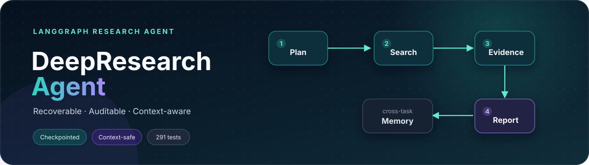
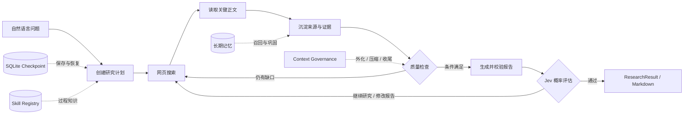
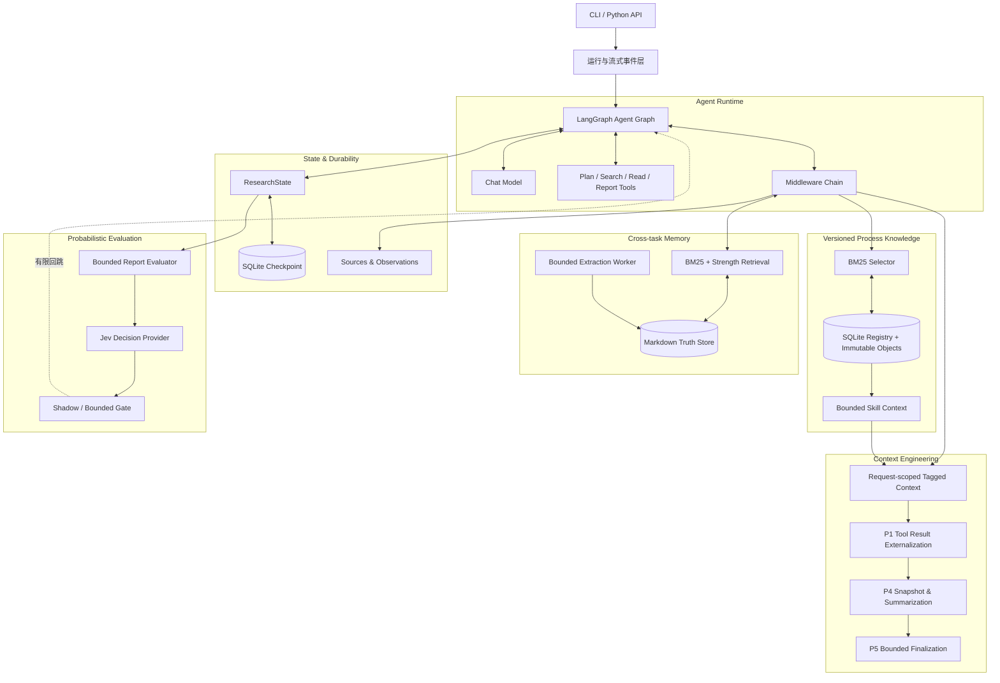

<div align="center">



# 🔬 DeepResearch Agent

**一个可运行、可恢复、可审计的深度研究智能体**

从自然语言问题出发，自动规划研究、搜索与读取网页、沉淀证据，并生成带来源的 Markdown 报告。

[](https://github.com/1612535983/deepreseach-learing/actions/workflows/tests.yml)


[](LICENSE)

[快速开始](#快速开始) · [工作流程](#工作流程) · [核心设计](#核心设计) · [Skill](#skill-系统) · [学习路线](#分阶段实现路线) · [示例报告](examples/sample-report.md)

</div>

---

## 项目简介

DeepResearch Agent 是一个面向学习与工程实践的 LangGraph 研究 Agent。它的输入是一个
自然语言问题，输出是包含回答、完整运行状态和可选 Markdown 报告的 `ResearchResult`。

它解决的不是“调用一次大模型”，而是如何让模型在一个有边界的执行系统中完成长任务：

- 先创建计划，再逐步搜索、阅读和整理证据；
- 用结构化 State 记录事实，而不是依赖模型描述自己做过什么；
- 用 Checkpoint 保存任务，使进程中断后仍能继续；
- 在上下文接近上限时外化、压缩并强制收尾；
- 在不同任务之间按需召回长期记忆。
- 按任务选择版本化 Skill，把“如何研究”作为受预算控制的过程知识注入模型。
- 用 Jev 输出报告质量与证据充分性的概率，并以有界 Gate 控制是否继续研究。

> [!NOTE]
> 这是一个围绕 LangGraph 自主搭建的学习型工程项目。设计过程中对照过多个开源 Agent 的
> 公开架构，但 README 中描述的能力都对应本仓库内的代码和测试；项目不隶属于任何参考项目。
> 参考资料与具体取舍集中放在[致谢与架构参考](#致谢与架构参考)，不作为项目功能背书。

### 输入与输出

| | 内容 |
|---|---|
| **输入** | 一个非空自然语言问题，例如“LangChain Agent 如何工作？” |
| **输出** | 最终回答、完整 `ResearchState`、任务 `thread_id`，以及可选 Markdown 报告 |
| **适合** | 技术调研、概念梳理、需要网页证据和引用的开放问题 |
| **暂不保证** | 来源内容一定真实、语义结论一定正确；规则与 Jev 概率评估都不代替人工事实核验 |

## 核心能力

| 🔎 研究闭环 | 🧭 可恢复执行 | 📐 上下文治理 |
|---|---|---|
| 计划、搜索、正文读取、证据聚合、引用校验、报告生成 | SQLite Checkpoint、`thread_id` 隔离、流式事件、任务恢复 | Token 观测、P1 外化、P4 摘要压缩、P5 强制收尾 |
| **🧠 长期记忆** | **🧩 Skill 系统** | **✅ 工程质量** |
| Markdown truth store、BM25 召回、衰减、软遗忘、后台巩固 | `SKILL.md`、不可变版本、BM25 选择、预算注入、效果指标 | 296 个测试、离线 Demo、GitHub Actions、模块化 Middleware |
| **🎯 概率评估** | **🔁 语义 Reflection** | **📊 评估遥测** |
| 相关性、证据支持、引用充分、证据足够概率与来源质量分 | Shadow 安全观测、Gate 有限回跳、P5 优先收尾 | Checkpoint、事件、Trace 中的延迟、Token、成本与质量分 |

## 工作流程



当前版本已完成 **阶段 12：概率与评估层**。上下文占用达到 40% 后执行 P1 外化；达到 80%
后先保存可验证 Snapshot，再用结构化摘要替换较旧历史；达到 90% 后进入 P5 收尾模式，
禁止继续扩张研究。P2、P3 当前用于治理观测，尚未单独改写上下文。

<details>
<summary><strong>展开完整 Agent 执行链</strong></summary>


```text
命令行问题
    ↓
Settings 读取模型配置
    ↓
ChatOpenAI（兼容 OpenAI 协议的模型）
    ↓
create_agent() 编译 Agent Graph
    ├── messages
    ├── research_question
    ├── search_records
    ├── page_records
    ├── plan / current_step_id
    ├── reflection_attempts / research_gaps
    ├── sources / observations
    ├── final_report
    ├── evaluation.report（概率、质量分、动作、延迟、Token、成本）
    ├── governance.context
    │   ├── 当前 Token / 上下文窗口 / 占用比例
    │   ├── 累计 Token / 模型调用次数
    │   └── pending_stages / hard_limit_reached
    ├── tagged_context（最后一次模型可见上下文的审计快照）
    ├── skills（选中的不可变版本引用与运行指标）
    └── SQLite Checkpointer（按 thread_id 持久化快照）
    ↓
ContextGovernanceMiddleware 调用模型前测量完整请求并判断 P1～P5
    ↓ P1 pending
ContextExternalizationMiddleware 外化较旧的大型 Tool 结果
    ├── 完整内容 → .deepresearch/externalized/<thread_id>/*.json
    ├── ToolMessage → 预览 + 路径 + estimated_tokens_saved
    └── 最近两个大型 Tool 结果保留原文
    ↓
ContextCompactionMiddleware 执行 P4
    ├── 压缩前 State/messages → .deepresearch/snapshots/<thread_id>/*.json
    ├── 内部摘要模型生成结构化 Markdown
    ├── 摘要没有减少 Token → 保留原消息
    └── 摘要成功 → summary + 最近消息（保持 Tool 配对）
    ↓
TaggedContextMiddleware 组装 request-scoped 模型视图
    ├── <system> / <goal> / <date>
    ├── <research_plan> / <research_progress> / <research_gaps>
    ├── <skill_context> / <memory_context>
    └── <turn> / <answer> / <toolcall> / <toolresult>
    ↓
SequentialToolCallMiddleware 禁止并行 Tool Call
    ↓
模型首次调用 write_research_plan
    ↓
模型判断是否调用 web_search
    ├── 不调用 → 直接回答
    └── 调用 → DuckDuckGo 搜索 → ToolMessage
                                ↓
                         EvidenceMiddleware
                         ├── search_records
                         ├── sources（按 URL 去重）
                         └── observations（关联 step_id）
                                ↓
                         再次调用模型
                                ↓
                         选择关键 URL 调用 read_page
                                ↓
                         EvidenceMiddleware
                         ├── page_records
                         └── 正文 observations（关联 step_id）
                                ↓
                         update_plan_step 推进计划
    ↓
ContextFinalizationMiddleware 执行 P5
    ├── 模型请求扩张型 Tool → 剥离 Tool Call，不进入 ToolNode
    ├── 注入隐藏收尾提醒 → jump_to="model"
    ├── 只允许 update_plan_step / write_final_report
    └── 再次违反 → 有界强制停止，避免无限循环
    ↓ 搜索/阅读持续失败或重复调用
Research Tool 运行预算触发同一套有界收尾
    ├── 搜索最多 12 次、阅读最多 12 次
    ├── 连续 4 次无效搜索或连续 3 次网页读取失败后收尾
    └── 同一搜索词执行 2 次后拦截第 3 次
    ↓
模型调用 write_final_report
    ↓
校验研究进度和引用 URL
    ↓
Markdown 报告写入 State.final_report
    ↓
模型准备结束
    ↓
ReflectionMiddleware 程序化检查
    ├── 计划、证据、报告齐全 → 允许结束
    └── 存在缺口 → 写入 research_gaps → 回到模型（最多 2 次）
                                                    ↓
                                      超过上限后保留缺口并允许结束
    ↓
ReportEvaluationMiddleware（可选 Jev）
    ├── 一次批量评估回答相关、证据支持、引用充分、证据足够、是否继续研究
    ├── Shadow → 只记录结果，不改变路由
    ├── Gate → continue_research / revise_report 最多回跳配置次数
    ├── 相同报告与证据签名不重复调用
    └── Provider 失败 fail-open；P5 收尾优先，不再扩张任务
    ↓
ResearchResult(question, answer, state)
    ↓ 可选 --output
save_markdown_report() 创建 .md 文件
```

</details>

流式模式不会重新组装另一套 Agent。`create_agent()` 仍然只负责生成同一个 Graph，
执行层可以选择 `invoke()` 一次性返回，或者选择 `stream()/astream()` 逐步接收结果：

```text
Compiled Agent Graph
    ├── invoke()  → 最后一次性返回 State
    └── stream()  → updates 转 ResearchEvent，values 保存最终 State
                                      ↓
                                CLI 实时显示
```

Checkpointer 在 `create_agent()` 时装入 Graph；运行时通过 config 提供 `thread_id`：

```text
SqliteSaver → create_agent(checkpointer=...)
                         ↓
graph.stream(..., config={"configurable": {"thread_id": "research-001"}})
                         ↓
LangGraph 在每个执行步骤后自动把 State 保存到 SQLite
                         ↓
下一个 CLI 进程用同一 thread_id 调用 graph.stream(None, config=...)
                         ↓
从最近的 Graph 节点继续执行
```

## 核心设计

这个项目把模型能力和确定性程序逻辑分开：模型负责规划、选择工具和撰写报告；程序负责
记录真实执行结果、约束工具顺序、校验引用、保存 Checkpoint 和控制上下文预算。这样既保留
Agent 的灵活性，也让关键状态可以测试、恢复和审计。

### 分层架构



这里有两条刻意分开的持久化路径：Checkpoint 保存“同一个任务如何继续运行”，长期记忆保存
“后续任务可能再次用到什么”。把二者分开，可以避免恢复执行和跨任务知识混成一个不可控的数据层。

## 快速开始

项目要求 Python 3.12+，推荐使用 `uv`：

```bash
uv sync --extra dev
```

先运行完全离线的 Demo，不需要 API Key：

```bash
uv run deepresearch demo
```

预期看到：

```text
最小链路已跑通：命令行输入已经进入 LangChain Agent Graph，模型响应也已被封装为 ResearchResult。
```

运行测试：

```bash
uv run pytest -q
```

## 接入真实模型

复制环境变量模板：

```bash
cp .env.example .env
```

填写 `.env` 后运行：

```bash
uv run deepresearch run "请解释 ReAct Agent 的基本工作方式"
```

显示由程序根据 State 计算的真实搜索记录和来源：

```bash
uv run deepresearch run "研究 LangChain Agent" --show-trace
```

把最终报告保存为新的 Markdown 文件：

```bash
uv run deepresearch run "研究 LangChain Agent" \
  --output reports/langchain-agent.md
```

`--output` 只负责把 `State.final_report` 写入磁盘，不会调用 LLM，也不会覆盖已有文件。
LLM 负责生成 Markdown 内容；`write_final_report` Tool 负责校验引用并更新 State；
`save_markdown_report()` 才是真正创建 `.md` 文件的代码。

想先看输出长什么样，可以打开
[示例报告：LangChain Agent 如何工作？](examples/sample-report.md)。示例经过压缩，仅用于展示
报告结构；真实输出会随问题、模型和搜索结果变化。

实时显示计划、Tool、证据、反思和报告进度：

```bash
uv run deepresearch run "研究 LangChain Agent" \
  --stream \
  --show-trace \
  --output reports/langchain-agent.md
```

`--stream` 使用程序根据真实 Graph 更新生成的 `ResearchEvent`，不是让 LLM 描述自己做了什么。
流式执行结束后仍会返回完整 `ResearchResult`，因此 Trace 和 Markdown 导出可以继续使用。

为当前运行指定 Checkpoint 任务 ID：

```bash
uv run deepresearch run "研究 LangChain Agent" \
  --thread-id research-001 \
  --stream
```

省略 `--thread-id` 时会自动生成 ID。Checkpoint 默认写入
`.deepresearch/checkpoints.sqlite`，该目录已被 Git 忽略。新任务不能复用已有 ID，以免把新问题
合并进旧 State；如果任务中断，应改用：

```bash
uv run deepresearch resume research-001 --stream
```

`resume` 不会重新调用 `create_initial_state()`。它把 `None` 作为 Graph 输入，并用相同的
`thread_id` 读取最近快照；已完成任务会直接返回保存结果，中断任务会从待执行节点继续。
恢复后的报告也可以配合 `--show-trace` 和 `--output reports/result.md` 使用。

不调用模型、只查看任务的最新持久化摘要：

```bash
uv run deepresearch inspect research-001
```

`inspect` 会显示原问题、Checkpoint 时间、Graph 步骤、计划进度、研究统计，以及保存在
Checkpoint State 中的模型名称、上下文窗口、当前 Token、占用比例、累计 Token、模型调用
次数、`pending_stages`、P1 外化数量、预计节省 Token，以及 Jev 质量分、动作、调用延迟、
Token 和成本。同步 Graph 使用 `SqliteSaver`，异步 Graph 使用
`AsyncSqliteSaver`。不要让两个进程同时用同一个 `thread_id` 执行；不同任务应使用不同 ID。

`--show-trace` 中的统计不调用 LLM；它直接读取 `search_records`、`page_records`、
`sources`、`observations`、`governance.context` 和 `evaluation.report`，用于区分真实执行记录与模型生成的
自然语言说明。

启用 Skill 后，可以先验证和查看目录，再运行任务：

```dotenv
DEEPRESEARCH_SKILL_USE=default
DEEPRESEARCH_SKILL_DIRS=skills
DEEPRESEARCH_SKILL_INCLUDE_BUILTIN=true
```

```bash
uv run deepresearch skills validate
uv run deepresearch skills list
uv run deepresearch skills show source-verification
uv run deepresearch run "核验这项声明并给出来源" --skill source-verification
```

`--skill` 是显式覆盖，可重复使用；没有覆盖时，Selector 使用问题与 Skill 元数据做确定性
BM25 排序，不额外消耗一次模型调用。`skills history/enable/disable/rollback` 用于查看版本、
切换启用状态和回滚激活版本。

建议先用 Jev 的 Shadow 模式收集数据，不改变 Agent 路由：

```dotenv
DEEPRESEARCH_EVALUATION_USE=jev
DEEPRESEARCH_EVALUATION_MODE=shadow
DEEPRESEARCH_JEV_API_KEY=your-typesafe-api-key
```

每个“报告 + 证据”版本只发起一次批量评估，得到回答相关、证据支持、引用充分、证据足够和继续研究
五个概率，以及来源质量分。发送给 Provider 的不是完整 `ResearchState`：Payload 只包含研究问题、
最终报告、报告声明引用的来源、这些来源对应的有限条 Observation 和计划摘要，并同时受总字符数、
报告长度、证据条数和单条证据长度限制。消息历史、长期记忆和 Skill 正文不会发送。

在 Shadow 的真实运行数据上确认阈值后，可以启用有界 Gate：

```dotenv
DEEPRESEARCH_EVALUATION_MODE=gate
DEEPRESEARCH_EVALUATION_MAX_GATE_ATTEMPTS=1
DEEPRESEARCH_EVALUATION_EVIDENCE_SUFFICIENCY_THRESHOLD=0.70
DEEPRESEARCH_EVALUATION_CONTINUE_RESEARCH_THRESHOLD=0.70
```

Gate 只对 `continue_research` 和 `revise_report` 回跳模型；`pass` 正常结束，低置信或矛盾结果
标记为 `review_required` 后结束。报告和证据的哈希签名保证同一版本不会重复收费，达到 Gate 上限
或上下文进入 P5 时也不会继续扩张。Provider 超时、响应不合法或网络失败采用 fail-open，错误类型
写入 State，但研究结果仍可返回。概率是评估模型的判断，不是事实正确率；上线阈值应使用带人工标签
的样本做校准和回归测试。

`run` 模式会把 `web_search` 和 `read_page` 注册给真实模型；模型可以先搜索，
再选择重要来源读取正文。`write_research_plan` 和 `update_plan_step` 负责创建并推进计划。
研究完成后，模型必须调用 `write_final_report`，并提交 Markdown 内容和实际引用的 URL。
Tool 会确认研究已经完成、至少引用两个收集过的来源，而且声明的 URL 确实出现在报告正文中。
`TaggedContextMiddleware` 每轮从 State 投影系统规则、研究目标、计划进度和聚合计数，并为
对话、回答、Tool Call 和 Tool 结果建立语义标签。投影只修改当次 `ModelRequest`，不会覆盖
State 中的原始消息；最后一次投影另存到 `tagged_context`，用于 Checkpoint 和审计。
`SequentialToolCallMiddleware` 会向模型绑定层传入 `parallel_tool_calls=False`，确保会更新
Plan 和 `current_step_id` 的 Tool 逐轮执行，避免多个 `Command` 同时写入同一个 State 字段。
`ReflectionMiddleware` 在模型不再调用 Tool、准备结束时读取 State，检查计划是否完成、
来源和 Observation 是否达到最小数量、是否成功读取过网页正文。检查不调用额外 LLM；
如果不满足，会把缺口交给下一轮模型，但最多回跳 2 次，避免无限循环。
`ReportEvaluationMiddleware` 只在上述确定性检查通过且报告已经保存后运行。它通过 Provider-neutral
接口调用 Jev，一次提交五个 `Noul` 问题和一个 `Score` 问题；Shadow 结果只进入 State，Gate
结果才会以 `<report_evaluation>` 投影给下一轮模型。评估结果由 Checkpointer 自动持久化，
`--stream`、`--show-trace` 和 `inspect` 都可查看质量分、动作、延迟、Token 与成本。
`ContextGovernanceMiddleware` 在每次模型调用后统计当前消息 Token、识别模型上下文窗口、
累计供应商返回的 Token usage，并按 P1～P5 阈值写入 `governance.context`。它也会在模型
调用前重新测量最终标签化请求，使刚进入 State 的 Tool 结果能在发送给下一轮模型前触发治理。
`ContextExternalizationMiddleware` 消费 `pending_stages` 中的 P1。它只处理达到最小长度的
旧 `ToolMessage`，最近两个结果暂时豁免；完整内容写入成功后，使用相同 message ID 把 State
中的消息替换成预览和路径。外化文件默认位于 `.deepresearch/externalized/<thread_id>/`，
目录已被 Git 忽略。写盘失败时不会替换原消息，以免丢失证据。
`ContextCompactionMiddleware` 消费 P4。它先把压缩前 messages 和非消息 State 保存到
`.deepresearch/snapshots/<thread_id>/`，快照带 schema 版本和 SHA-256 校验，并可恢复为
LangChain 消息。随后由内部摘要调用压缩较旧前缀，最近约 6 条消息按完整交互单元保留，
不会拆开 `AIMessage(tool_calls)` 与对应 `ToolMessage`。Snapshot、摘要调用或 Token 缩减校验
任一步失败，都不会删除原历史。内部摘要调用不计入主 Agent 的 `model_call_count`。
`ContextFinalizationMiddleware` 消费 P5。它在模型生成 Tool Call 后、ToolNode 执行前检查调用：
搜索、网页读取、重新建计划和未知 Tool 会被从同 ID 的 `AIMessage` 中剥离，因此不会产生孤立
`ToolMessage`，也不会真的执行；随后加入一次隐藏收尾提醒并回跳模型。为了兼容本项目的正式报告
流程，`update_plan_step` 和 `write_final_report` 仍可有限执行。收尾模式一旦触发便在当前任务中
保持有效，Reflection 不再增加研究轮次；扩张型 Tool 再次违反或收尾 Tool 超过上限时直接停止，
防止预算保护本身形成死循环。
同一个 Middleware 也负责研究 Tool 运行预算：搜索或读取连续失败、同一搜索词反复调用、或者
达到总次数上限时，在下一次 Tool 真正执行前剥离调用，并通过流式 `finalization` 事件说明原因。
模型获得一次使用已有证据更新计划和写报告的机会；如果仍请求扩张型 Tool，则有界强制结束。
`demo` 模式仍使用无工具的 Fake Model，保证在没有网络和 API Key 时也能验证基础链路。

`.env` 已被 `.gitignore` 排除，真实 API Key 不会进入 Git。

## 项目结构

```text
deepresearch-agent/
├── src/deepresearch/
│   ├── agent.py             # 组装并运行 Agent Graph
│   ├── state.py             # 研究状态与 reducer
│   ├── checkpointing.py     # SQLite Checkpoint 与任务恢复
│   ├── context/             # Token、窗口、外化、快照和摘要策略
│   ├── memory/              # 长期记忆 Schema、存储、检索与 Worker
│   ├── skill/               # Skill 解析、版本仓库、选择、注入和指标
│   ├── evaluation/          # Jev Provider、受控 Payload、概率合成与契约
│   ├── middlewares/         # 证据、反思、评估、治理、记忆等横切逻辑
│   └── tools/               # 搜索、网页读取、计划和最终报告
├── tests/                   # 296 个自动化测试
├── examples/                # 可公开查看的输出样例
├── .github/workflows/       # GitHub Actions 自动测试
└── pyproject.toml           # 依赖、脚本入口与打包配置
```

第一次阅读代码，建议按
`cli.py → agent.py → state.py → tools/ → middlewares/ → context/ → memory/ → skill/ → evaluation/`
的顺序理解。先看输入如何进入系统，再看状态如何流动，会比从某个复杂 Middleware 开始容易。

## 名词解释

- **LLM / 大模型**：接收消息并生成回答的模型，本阶段使用 `ChatOpenAI` 适配兼容 OpenAI 协议的服务。
- **Agent**：让模型在一个执行框架中运行的程序；当前模型可以判断是直接回答，还是先调用搜索工具。
- **Graph**：Agent 的执行流程图。`create_agent()` 会为我们生成最基本的模型调用循环。
- **ReAct**：Reason + Act，即“判断下一步并执行动作”。当前动作包括 `web_search` 和 `read_page`，工具结果会返回模型形成下一轮判断。
- **Tool**：可执行能力，例如网页搜索、网页读取和文件操作。
- **Skill**：告诉 Agent“应该怎样完成某类任务”的过程知识，通常是提示词，不等于 Tool。
- **Middleware**：插在 Agent 生命周期中的横切逻辑，例如模型调用前注入 Skill、工具调用后收集证据。
- **State**：Graph 节点之间共享的数据，例如消息、来源、研究计划和最终报告。
- **上下文投影**：从完整 State 中筛选当前模型真正需要的字段；本项目只投影计划和聚合进度，不投影全部内部数据。
- **反思（Reflection）**：模型准备结束时进行质量检查。第一层是确定性程序规则；启用 Jev Gate 后，第二层使用受控概率判断证据是否足够。
- **Jev**：TypeSafe AI 的概率决策模型。本项目把它封装为可替换的 `DecisionProvider`，不让供应商协议侵入 Agent 主流程。
- **Noul**：Jev 输出 0～1 连续概率的题型；本项目用它表达“回答相关”“证据足够”等语义判断。
- **Shadow / Gate**：Shadow 只观测和记录，不改变结果；Gate 可依据阈值回跳，但受次数上限和 P5 约束。
- **回跳（jump_to）**：Middleware 返回的图路由指令。`jump_to="model"` 表示当前不结束，重新执行模型节点。
- **Markdown**：一种纯文本格式。LLM 生成 Markdown 字符串，Python 再把字符串写入 `.md` 文件。
- **ResearchEvent**：由 LangGraph 原始更新转换出的稳定应用事件，用于 CLI，未来也可以用于 SSE 或 WebSocket。
- **Checkpointer**：在 Graph 执行步骤结束后自动保存 State 快照；`thread_id` 用来区分任务。
- **Checkpoint**：某一执行时刻的 State 和 Graph 运行位置；恢复时不需要应用代码手动重放每个 Tool。
- **SQLite**：单文件关系型数据库。本项目用它持久化 Checkpoint，不用额外启动数据库服务。
- **Token**：模型处理文本时使用的计量单位，不等同于字符数；当前优先使用模型计数器，不可用时采用字符估算。
- **上下文窗口**：一次模型请求可容纳的 Token 上限。当前按显式配置、模型属性、名称映射、默认值的顺序识别，并记录识别来源。
- **pending_stages**：当前占用比例已经触发但尚未真正执行的 P1～P5 治理阶段。
- **外化（Externalization）**：把大体积内容从模型消息搬到外部文件，消息中只保留预览、文件位置和校验元数据。它减少上下文 Token，但不等同于删除原始结果。
- **Snapshot**：压缩前保存的可校验恢复点。P4 摘要丢失细节时，仍可通过快照和外化文件追溯原内容。
- **摘要压缩**：让内部模型把较旧消息转换成结构化摘要，再用 LangGraph 消息 reducer 清理旧前缀并保留最近对话。
- **强制收尾**：上下文进入 P5 后停止产生新研究材料，只允许整理计划、保存报告或直接基于已有证据作答。

## 分阶段实现路线

每个阶段都应该满足“代码可运行、测试通过、单独 Git 提交”后，再进入下一阶段。

1. **阶段 0（已完成）— 最小 Agent**：CLI → 模型 → `create_agent` → 回答。
2. **阶段 1（已完成）— 第一个 Tool**：增加 `web_search`，让模型产生 tool call，并把搜索结果返回模型。
3. **阶段 2（已完成）— 研究 State**：加入 `search_records`、`sources`、`observations`、`research_question` 和 reducer。
4. **阶段 3（已完成）— 第一个 Middleware**：由 Evidence Middleware 把工具结果整理为证据，并提供真实执行 Trace。
5. **阶段 4（已完成）— 网页正文读取**：增加安全 URL 校验和 `read_page`，把关键网页正文沉淀为证据。
6. **阶段 5（已完成）— 结构化研究计划**：模型创建和推进 Plan，Middleware 选择性注入进度，证据关联步骤。
7. **阶段 6A（已完成）— 受限研究反思**：程序检查计划和证据，通过 `jump_to` 最多继续研究 2 次。
8. **阶段 6B（已完成）— 最终报告**：校验报告引用，保存到 `final_report`，并由 CLI 导出 `.md` 文件。
9. **阶段 7（已完成）— 流式输出**：把 `stream()/astream()` 更新转换成统一事件，并在 CLI 实时显示。
10. **阶段 8A（已完成）— 内存 Checkpointer**：把 Checkpointer 装入 Graph，通过 config 的 `thread_id` 自动保存和隔离 State。
11. **阶段 8B（已完成）— SQLite Checkpointer**：让 Checkpoint 跨进程持久化，并增加 `resume` 和 `inspect` 命令。
12. **阶段 9A（已完成）— Context Governance 观测层**：增加治理 State、Token 统计、模型窗口识别、阈值判断、Middleware 记录，以及 Trace/inspect 展示；暂不修改消息。
13. **阶段 9B（已完成）— Tagged Context**：保留原始 State，同时组装并审计带语义标签的模型请求视图。
14. **阶段 9C（已完成）— P1 Tool 结果外化**：把较旧的大体积 Tool 结果安全保存到消息之外，只保留预览、引用和校验元数据。
15. **阶段 9D（已完成）— P4 Snapshot 与摘要压缩**：保存带校验的压缩前快照，用结构化摘要替换旧上下文，并保证最近消息和 Tool 配对完整。
16. **阶段 9E（已完成）— P5 强制收尾**：高占用时拦截扩张型 Tool，引导模型生成最终产物，并用有界停止避免死循环。
17. **阶段 10（已完成）— 记忆系统**：使用独立 Markdown truth store、BM25 召回、惰性衰减、软遗忘和后台巩固，实现跨任务长期记忆。
18. **阶段 11（已完成）— Skill**：解析 Poirot 风格的 `SKILL.md`，用不可变版本仓库、确定性选择、预算注入、Checkpoint 引用和效果指标管理过程知识。
19. **阶段 12（已完成）— 概率与评估层**：使用 Provider-neutral 接口接入 Jev，批量评估回答相关性、证据支持、引用充分性、证据充分性、继续研究概率和来源质量；支持 Shadow、有限 Gate、Checkpoint 与完整遥测。
20. **阶段 12B（已完成）— 研究循环预算**：限制总搜索/读取次数、连续失败和重复查询；在 Tool 执行前触发有界收尾，避免外部服务异常导致无限循环。
21. **阶段 13 — 评估数据集与概率校准**：积累人工标签，计算 Brier Score、ECE、阈值回归和质量/成本 Pareto，避免直接把模型概率当成事实正确率。
22. **后续阶段**：MCP、Sandbox、API/前端，最后再考虑多 Agent。

## Git 管理建议

当前项目直接在 `main` 上按阶段开发；每次提交前必须先跑完测试，让 `main` 始终保持可运行：

```text
main: minimal-agent → web-search-tool → research-state → middleware → skill
```

日常流程：

```bash
# 修改代码并测试
uv run pytest -q
git add .
git commit -m "feat: add web search tool"
```

一次提交只完成一个可解释的变化。不要提交 `.env`、`.venv`、缓存、运行日志和本地数据库。

## 架构取舍与开源参考

本项目不是对某一个仓库的逐模块移植。下面列出的是公开架构带来的设计问题，以及本项目给出的
具体答案，方便区分“参考了什么思想”和“代码实际实现了什么”。

| 设计问题 | 本项目的实现 | 与公开项目的关系 |
|---|---|---|
| Agent 如何持续执行 | 使用 LangChain `create_agent` 构建 LangGraph 循环，以 Middleware 组合证据、反思、上下文和记忆能力 | 直接建立在 [LangChain Agents](https://docs.langchain.com/oss/python/langchain/agents) 与 [LangGraph](https://docs.langchain.com/oss/python/langgraph/overview) 的公开接口上 |
| 研究任务如何闭环 | 显式计划 → 搜索 → 正文读取 → 证据聚合 → 缺口检查 → 引用报告 | 与 [Open Deep Research](https://github.com/langchain-ai/open_deep_research) 等研究 Agent 共享 Plan-and-Research 思路；状态字段和校验规则由本项目实现 |
| 长上下文如何治理 | P1 把大型 Tool 结果外化到文件；P4 先保存可校验 Snapshot 再摘要；P5 禁止扩张型 Tool 并有界收尾 | [DeerFlow Context Engineering](https://github.com/bytedance/deer-flow/blob/main/frontend/src/content/en/introduction/core-concepts.mdx) 同样强调摘要和文件系统外部工作记忆；本项目没有照搬其实现，也尚未采用子 Agent 上下文隔离 |
| 上下文如何保持可审计 | 原始 State 保留，模型每轮只接收 request-scoped Tagged Context；压缩失败或未节省 Token 时不替换历史 | 与 DeerFlow 的“只给模型当前工作集”原则方向一致，但标签协议、治理阶段和失败回退是本项目自己的实现 |
| 任务恢复与长期记忆如何区分 | SQLite Checkpoint 恢复同一 Graph；Markdown truth store 保存跨任务记忆，两条数据链互不替代 | Checkpoint 使用 LangGraph 能力；“运行状态与跨会话记忆分层”也是 DeerFlow 等 long-horizon harness 的通用设计 |
| 记忆如何存取 | `episodic / semantic / procedural` 三类 Trace，Markdown 持久化，BM25 + strength 召回，惰性衰减、软遗忘和后台巩固 | DeerFlow 2.0 当前强调可插拔 Memory backend；本项目选择更小、更透明的本地实现，不依赖向量数据库，也不声称兼容 DeerMem |
| 过程知识如何复用 | Poirot 风格的 `SKILL.md` 契约；SQLite 保存元数据和指标，内容寻址对象保存不可变正文；State 只保存版本引用 | 参考 Poirot 的工程分层思路，但解析契约、选择器、P4/P5 预算策略、CLI 和测试均由本项目实现 |
| 概率判断如何进入主流程 | Provider-neutral evaluator 只接收有界报告/证据投影；默认 Shadow，Gate 有次数上限、签名幂等、fail-open 和 P5 优先级 | Jev 的题型和 API 参考 [TypeSafe AI 官方文档](https://docs.typesafe.ai/introduction)；Payload、阈值、路由和可观察性是本项目实现 |

> [!IMPORTANT]
> DeerFlow 是包含 Harness、App、Sub-agent、Sandbox、Skills、MCP 和多种 Memory backend 的完整系统。
> 本项目目前是单 Agent、CLI 优先的研究内核，已经实现本地 Skill 和 Memory，但尚未实现
> Sub-agent、Sandbox、MCP 与完整 Web App；README 不把路线图当成已完成功能。

## 长期记忆

长期记忆与 Checkpoint 是两套数据：`.deepresearch/checkpoints.sqlite` 保存单个
`thread_id` 的 Graph State，`.deepresearch/memory/traces.md` 保存可跨任务召回的
记忆。默认关闭；在 `.env` 中启用：

```dotenv
DEEPRESEARCH_MEMORY_USE=default
DEEPRESEARCH_MEMORY_NAMESPACE=default
DEEPRESEARCH_MEMORY_ENABLE_RECALL=true
DEEPRESEARCH_MEMORY_ENABLE_EXTRACT=false
```

召回开启后，Retriever 使用中文/英文基础分词、BM25 和记忆 strength 排序。
召回正文只进入本次请求的 `<memory_context>`，不会追加到正式 `messages`。
将 `DEEPRESEARCH_MEMORY_ENABLE_EXTRACT` 改为 `true` 后，Agent 完整结束时会把任务
提交给有界 Worker，由模型提取 episodic/semantic/procedural 记忆；Manager 本身
不调用模型。`deepresearch inspect <thread_id>` 会同时显示本轮召回指标和外部记忆库统计。

## Skill 系统

Skill 解决的是“Agent 应该怎样完成某类任务”，Tool 解决的是“Agent 能执行什么动作”。
本系统的输入是一个或多个 `SKILL.md`、当前问题和可用 Tool；输出是最多
`DEEPRESEARCH_SKILL_MAX_SKILLS` 个版本化引用，以及受
`DEEPRESEARCH_SKILL_TOKEN_BUDGET` 限制的 `<skill_context>`。

一个最小 Skill：

```markdown
---
name: source-verification
description: 核验事实声明和来源
version: 1
tags: [来源, 核验]
tools: [web_search, read_page]
enabled: true
---
# 来源核验

优先读取一手来源，并交叉核验关键结论。
```

完整执行流程：

```text
启动扫描 builtin_skills/ 与用户目录
    ↓
Parser 校验 frontmatter、正文、大小和路径边界
    ↓
SQLite Registry 保存元数据、父版本与效果指标
Content-addressed Store 保存带 SHA-256 校验的不可变 Markdown
    ↓
SkillSelector 根据问题和元数据做 BM25 排序
    ├── --skill NAME → 强制选择
    └── 自动选择 → relevance + 可用 Tool 过滤
    ↓
ResearchState.skills 只保存 skill_id / hash / score，不复制正文
    ↓
SkillContextRenderer 按不可变引用加载正文
    ├── 超预算 → 先退化为 description，再丢弃
    ├── P4 → 只投影 description
    └── P5 → 只保留报告/收尾 Skill
    ↓
TaggedContextMiddleware 把 <skill_context> 放入当次模型请求
    ↓
Metrics 记录 selection / injection / aligned tool call / outcome
```

这套结构有三个恢复保证：正文不会写入 canonical messages；Checkpoint 保存的是确切
`skill_id + content_hash`；源目录出现新版本后，旧任务恢复时仍读取旧的内容对象，不会在任务
中途悄悄换流程。读取失败、hash 不一致或单个 Skill 无效时采用 fail-open：记录错误并跳过，
不会阻止 Agent 使用基础研究能力。

项目自带 `web-research`、`source-verification` 和 `evidence-report-writing` 三个 Skill。
内置目录先加载，用户目录后加载，因此同名用户版本会成为新的激活版本，并保留内置版本作为
可回滚父版本。Skill 默认关闭，保证升级后旧行为不变。

## 测试与贡献

运行完整测试：

```bash
uv run pytest -q
```

当前测试覆盖 Agent 执行、工具、Middleware、Checkpoint、流式事件、上下文治理、长期记忆、
Skill、Jev 协议适配、报告概率评估和有界 Gate。
每次 push 或 pull request 也会通过 GitHub Actions 在 Python 3.12 上自动执行测试。

欢迎通过 Issue 提交 Bug、文档建议或可复现的改进想法。提交代码前请保证：

1. 不包含 API Key、`.env`、本地数据库或运行时记忆；
2. 一个提交只处理一个可以解释的问题；
3. 新行为包含对应测试，且现有测试保持通过；
4. README、类型注解和错误信息与代码行为一致。

## 致谢与架构参考

项目建立在 [LangChain](https://github.com/langchain-ai/langchain) 与
[LangGraph](https://github.com/langchain-ai/langgraph) 的公开能力之上；设计过程中也对照了
[DeerFlow](https://github.com/bytedance/deer-flow)、
[Open Deep Research](https://github.com/langchain-ai/open_deep_research)、
[Poirot](https://github.com/HezaoHezao/poirot) 和其他研究 Agent 的
公开实现。它们用于理解不同架构选择，不代表本项目与其存在官方关系或一一对应的源码关系。
完整说明见 [ACKNOWLEDGMENTS.md](ACKNOWLEDGMENTS.md)。

本项目采用 [MIT License](LICENSE)。你可以学习、使用和修改代码；分发副本或重要代码片段时，
请保留许可证和版权声明。
